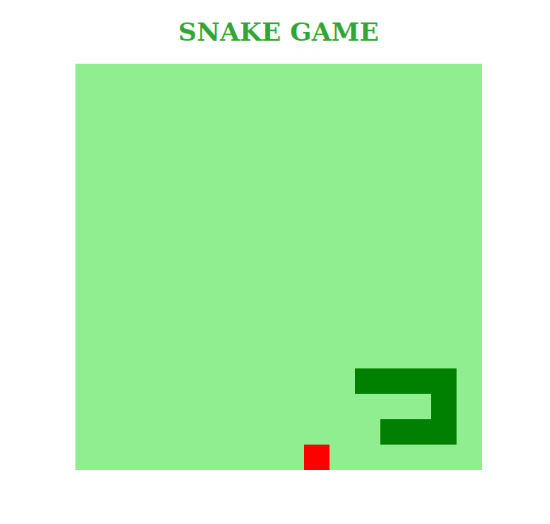

# Projeto: snake_game-javascript

## INFORMAÇÕES
Aula Front-end de JavaScript da [Gabriela Pinheiro](https://github.com/SpruceGabriela), na [Digital Innovation One](https://web.digitalinnovation.one) “Recriando o jogo da cobrinha com JavaScript”.

### TECNOLOGIAS UTILIZADAS: 
* JAVASCRIPT
* CSS3
* HTML5

### SCREENSHOT:

### DISPONÍVEL EM: [https://dagriel.github.io/snake-game](https://dagriel.github.io/snake-game)